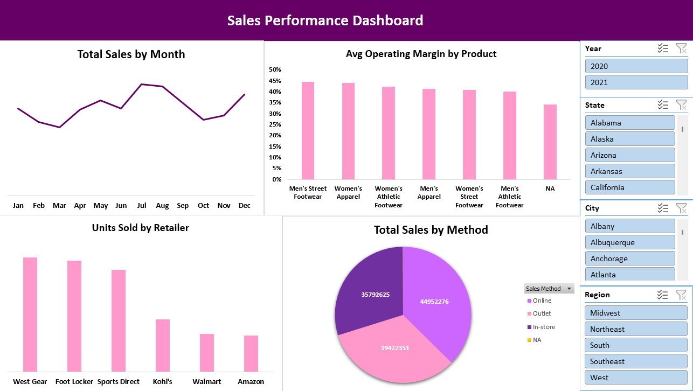

# Sales Data Analysis Project

## 📌 Project Overview
This project focuses on **analyzing sales data** using Microsoft Excel.  
The workflow covers data cleaning, transformation, and visualization to extract business insights.

## 🛠️ Data Cleaning & Preparation
- Handled missing values (calculated from related columns or filled with "NA").
- Removed duplicate records.
- Adjusted data types for accuracy.
- Trimmed spaces in text fields for consistency.

## 📊 Analysis & Visualizations
Created **4 Pivot Tables with charts**:
1. **Total Sales by Months**
2. **Units Sold by Retailer**
3. **Total Sales by Sales Method**
4. **Average Operating Margin by Product**

Added **slicers** for `Year`, `State`, `City`, and `Region` to enable interactive filtering.

## 🔑 Key Insights
- Highest sales month: **July**  
- Lowest sales month: **March**  
- Top retailer: **West Gear**  
- Lowest retailer: **Amazon**  
- Most successful sales method: **Online**  
- Least successful sales method: **In-store**  
- Best-performing product: **Men's Street Footwear**  
- Lowest-performing product: **Men's Athletics Footwear**

## 🚀 Tools Used
- Microsoft Excel (Data Cleaning, Pivot Tables, Charts, Slicers)

## 📸 Dashboard Preview

## 📈 Outcome
This project demonstrates my ability to:
- Perform data cleaning and preprocessing.  
- Build pivot-based dashboards.  
- Derive insights that support data-driven decision making.  
